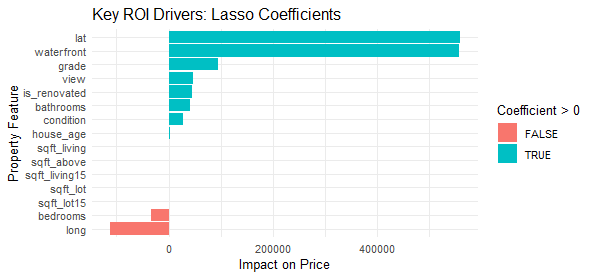
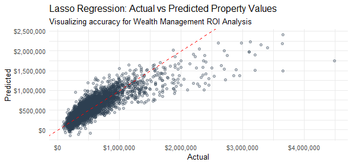
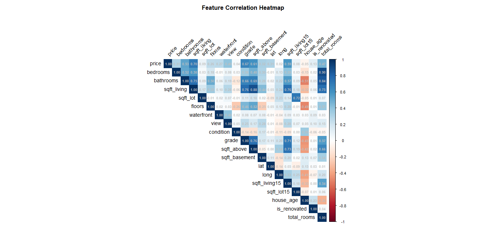

# **Real Estate Investment ROI Optimizer**

## **📌 Business Case**

How can a wealth management firm identify the true "Alpha" drivers of property value in a volatile market? Traditional valuation often relies on raw square footage, but real-world value is driven by a complex interplay of location, quality, and scarcity.

This project utilizes a **Regularized Regression Pipeline** to filter out statistical noise and identify the high-impact variables that drive Return on Investment (ROI). By comparing three distinct parametric architectures, I developed a model that balances predictive accuracy with the clarity needed for executive decision-making.

-----

## **📂 Data Description**

The model is trained on the **King County Housing Dataset**, representing over 21,000 home sales. Each observation is an investment profile composed of the following key features:

  * **Price (Target):** The sale price of the home, used to calculate potential ROI.
  * **Location (Lat/Long):** Precise geographic coordinates used to identify high-value residential corridors.
  * **Grade:** An index representing the quality of construction and design (1-13). This is a primary driver for luxury tier valuation.
  * **Living Space (sqft\_living):** The interior square footage, a standard metric for property size.
  * **Condition:** A rating of the property's physical state (1-5), helping investors identify "Fix-and-Flip" opportunities.
  * **Waterfront:** A binary indicator of premium shoreline access, often associated with the highest scarcity premiums.
  * **House Age:** A calculated feature (2026 - Year Built) used to model the depreciation or historical value of the asset.

-----

## **🛠️ The Machine Learning Pipeline**

  * **Algorithms Compared:**
      * **OLS Linear (Baseline):** The standard statistical foundation.
      * **Ridge (Stabilizer):** Utilized $L_2$ regularization to handle the high multicollinearity between property features like bedrooms and bathrooms.
      * **Lasso (The Filter):** Utilized $L_1$ regularization to perform automated feature selection and identify the most critical ROI drivers.
  * **Feature Engineering:** Transformed raw construction years into "House Age" and engineered binary indicators for renovation status to better capture market value.

-----

## **📊 Model Performance**

I evaluated the models using **RMSE** (average dollar error) and **Adjusted $R^2$** to ensure the model was not over-fitting by adding useless complexity.

| Model | RMSE | MAE | **Adjusted $R^2$** |
| :--- | :--- | :--- | :--- |
| **Lasso Regression** | **$196,340** | **$123,694** | **0.7109** |
| **OLS Linear** | $196,337 | $123,900 | 0.7108 |
| **Ridge Regression** | $197,099 | $122,646 | 0.7101 |

**Conclusion:** **Lasso** emerged as the preferred model. While it shared similar accuracy with OLS, its ability to mathematically simplify the model by penalizing low-impact variables makes it the most robust tool for investment forecasting.

-----

## **💡 Investment Insights: The ROI Drivers**

The Lasso model’s coefficients provide a "map" for where to invest. By analyzing the standardized impact, we see that location and scarcity outweigh sheer size:

1.  **Geography is King:** **Latitude (lat)** had the highest positive impact (\~$560k), highlighting specific high-value corridors.
2.  **Scarcity Premium:** A **Waterfront** view adds an average of **$557,562** to the property value—the single largest physical feature driver.
3.  **Quality vs. Quantity:** **Grade (Construction quality)** and **View** significantly outperformed **Total Bedrooms** in value contribution. In fact, adding bedrooms without increasing overall quality actually showed a negative coefficient (-$33k), suggesting an "over-crowding" penalty in high-end markets.

-----

## **📈 Visual Analytics & Diagnostics**

### **1. Prediction Accuracy (Lasso)**

The model shows high precision along the **45-degree identity line** for the core market ($300k - $1.2M). The "fanning" (heteroscedasticity) in the $2M+ tier indicates that luxury estates follow unique logic requiring specialized sub-models.

### **2. Feature Correlation (The Case for Regularization)**

The heatmap reveals high multicollinearity (e.g., `sqft_living` vs `grade` at 0.76). This justifies the use of **Ridge and Lasso** to prevent the model from becoming unstable or biased.
-----

## **🚀 Implementation & Value**

For a Wealth Management client, this tool allows for:

  * **Renovation Priority:** Identifying that quality "Grade" improvements yield higher returns than simply adding more rooms.
  * **Market Filtering:** Rapidly screening thousands of properties to find "underpriced" assets that don't yet reflect their Latitude/Waterfront potential.
